# NpcCommonLib

Shared types and interfaces used by all NPC simulation libraries. This project exists to break circular dependencies -- any type referenced by more than one library lives here.

## Contents

| Namespace | Types | Purpose |
|---|---|---|
| `NpcCommonLib.Math` | `Vec3` | Double-precision 3D vector with operator overloads, normalization, clamping, dot/cross, lerp |
| `NpcCommonLib.Data` | `ConstructId`, `ScanContact`, `ConstructTransformResult`, `ConstructVelocityResult` | Value types shared across movement, targeting, and weapon systems |
| `NpcCommonLib.Interfaces` | `IConstructService`, `IConstructUpdateService`, `IRadarService` | Game-server boundary contracts implemented by your mod's integration layer |

## Dependency Diagram

```mermaid
graph BT
    Common[NpcCommonLib<br/>Vec3 · ConstructId · ScanContact<br/>IRadarService · IConstructService]

    Movement[NpcMovementLib<br/>MovementSimulator · Strategies<br/>WaypointNavigator]
    Targeting[NpcTargetingLib<br/>TargetingSimulator · Strategies<br/>DamageTracker · ThreatCalculator]
    Weapon[NpcWeaponLib<br/>FiringSimulator<br/>WeaponSelector · FireRate]

    Movement --> Common
    Targeting --> Common
    Weapon --> Common

    style Common fill:#2d333b,stroke:#cba6f7
    style Movement fill:#2d333b,stroke:#539bf5
    style Targeting fill:#2d333b,stroke:#57ab5a
    style Weapon fill:#2d333b,stroke:#f47067
```

All three consumer libraries depend on `NpcCommonLib`. None of them depend on each other -- they can be composed freely at the integration layer.
