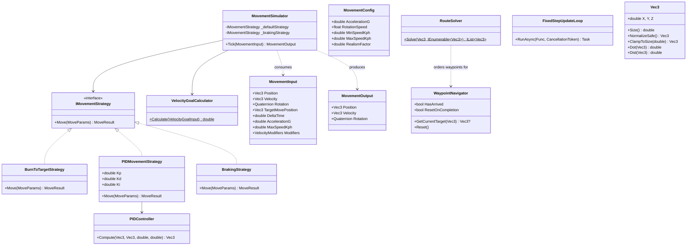

# NpcMovementLib

A standalone C# class library for simulating NPC construct movement in a Dual Universe PvE mod. Pure data-in / data-out design with zero game-server dependencies -- feed it positions and velocities, get back new positions and velocities.

## Features

- **Pure simulation** -- no DI containers, no database, no NQ SDK types. Only `System.Numerics` from the BCL.
- **Pluggable movement strategies** -- BurnToTarget (kinematic interpolation with delta-V clamping), PID controller, and Braking, all behind a single `IMovementStrategy` interface.
- **Velocity goal calculator** -- range-aware speed modulation based on weapon optimal range, target velocity, and configurable dot-product modifiers.
- **Waypoint navigation** -- stateful `WaypointNavigator` with looping support and a nearest-neighbor `RouteSolver` for waypoint ordering.
- **Fixed-step update loop** -- deterministic 20 FPS tick with accumulator-based catch-up to prevent physics drift.
- **Custom `Vec3` math** (via `NpcCommonLib`) -- double-precision 3D vector struct with operator overloads, normalization, clamping, cross/dot products, and lerp.
- **Integration interfaces** (via `NpcCommonLib`) -- `IConstructService`, `IConstructUpdateService`, and `IRadarService` define the contract your game-server adapter must implement.

## Getting Started

### Add the project

```xml
<ProjectReference Include="..\NpcMovementLib\NpcMovementLib.csproj" />
```

The library targets `net8.0` and has no external NuGet dependencies.

### Basic usage

```csharp
using NpcMovementLib;
using NpcMovementLib.Data;
using NpcCommonLib.Math;

// Create the simulator (defaults to BurnToTargetStrategy)
var simulator = new MovementSimulator();

// Build input for one tick
var input = new MovementInput
{
    Position   = new Vec3(1000, 2000, 3000),
    Velocity   = new Vec3(100, 0, 0),
    Rotation   = Quaternion.Identity,

    TargetMovePosition = new Vec3(50000, 60000, 70000),
    DeltaTime          = 0.05,          // 50 ms fixed step

    AccelerationG = 15,
    MaxSpeedKph   = 20000,
    MinSpeedKph   = 2000,
    RotationSpeed = 0.5f,
    RealismFactor = 0.0,                // 0 = direct accel, 1 = forward-only
    EnginePower   = 1.0,
};

// Tick
MovementOutput result = simulator.Tick(input);

// result.Position  -- new world position (Vec3)
// result.Velocity  -- new velocity in m/s (Vec3)
// result.Rotation  -- new orientation (Quaternion)
```

To use the PID strategy instead:

```csharp
var simulator = new MovementSimulator(new PIDMovementStrategy { Kp = 0.2, Kd = 0.3 });
```

## Component Design

The following diagram shows how data flows through a single `Tick` call.

```mermaid
flowchart TD
    MI[MovementInput] --> MS[MovementSimulator.Tick]

    MS --> FWD[Compute forward & move direction]
    MS --> ACC[Compute acceleration vector<br/>blend forward + move via RealismFactor]

    ACC --> VGC[VelocityGoalCalculator.Calculate<br/>range-aware speed target]
    VGC --> SEL{IsBraking or<br/>EnginePower = 0?}

    SEL -- yes --> BRK[BrakingStrategy]
    SEL -- no --> DEF[Default IMovementStrategy<br/>BurnToTarget / PID]

    BRK --> MR[MoveResult: position + velocity]
    DEF --> MR

    MR --> ROT[Rotation via Quaternion.Slerp<br/>toward movement direction]
    ROT --> MO[MovementOutput]

    WN[WaypointNavigator] -.-> MI
    RS[RouteSolver] -.-> WN

    style MI fill:#2d333b,stroke:#539bf5
    style MO fill:#2d333b,stroke:#57ab5a
    style WN fill:#2d333b,stroke:#cba6f7,stroke-dasharray: 5 5
    style RS fill:#2d333b,stroke:#cba6f7,stroke-dasharray: 5 5
```



`WaypointNavigator` and `RouteSolver` are optional -- they feed a target position into `MovementInput` but are not required for single-target movement.

## Architecture



## Movement Strategies

All strategies implement `IMovementStrategy.Move(MoveParams) -> MoveResult` and return a new position and velocity.

### BurnToTarget (default)

The workhorse strategy. Uses `VelocityHelper.LinearInterpolateWithAccelerationV2` to accelerate toward the target with kinematic equations, clamping velocity to the goal speed computed by `VelocityGoalCalculator`. After computing the new velocity, it enforces a **delta-V limit** -- the velocity change per tick cannot exceed `maxAcceleration * deltaTime` -- which prevents unphysical instant course corrections.

```csharp
// Delta-V clamping excerpt from BurnToTargetStrategy
var deltaV = velocity - v0;
var maxDeltaV = @params.Acceleration.Size() * @params.DeltaTime;
if (deltaV.Size() > maxDeltaV)
{
    deltaV = deltaV.NormalizeSafe() * maxDeltaV;
    velocity = v0 + deltaV;
}
```

### PID

Uses a PID controller (`Kp`, `Ki`, `Kd` gains) to compute a desired acceleration vector from the position error. Includes a **braking threshold** at 100 km -- when the NPC is closer than that, it reverses thrust to decelerate. Good for smooth, oscillation-damped approaches.

### Braking

Decelerates to zero using per-axis braking via `VelocityHelper.ApplyBraking`. Selected automatically when `IsBraking` is true or `EnginePower` is zero.

## Navigation

### WaypointNavigator

A stateful queue-based navigator. Feed it a list of `Vec3` waypoints and an arrival distance (default 50 km). Each call to `GetCurrentTarget(currentPosition)` returns the next waypoint, automatically advancing when the NPC is within arrival distance.

```csharp
var nav = new WaypointNavigator(waypoints, arrivalDistance: 50000);
nav.ResetOnCompletion = true; // loop the route

while (!nav.HasArrived)
{
    var target = nav.GetCurrentTarget(npcPosition);
    if (target == null) break;
    input.TargetMovePosition = target.Value;
    // ... tick the simulator
}
```

### RouteSolver

A nearest-neighbor heuristic for ordering waypoints. Given a starting position and a set of points, it returns them sorted by a greedy shortest-path traversal. Use it to feed an efficient route into `WaypointNavigator`.

```csharp
var orderedRoute = RouteSolver.Solve(startPosition, unorderedWaypoints);
var nav = new WaypointNavigator(orderedRoute);
```

## Fixed-Step Update Loop

`FixedStepUpdateLoop` provides a deterministic tick loop for driving the simulation. It accumulates real elapsed time and consumes it in fixed 50 ms chunks (20 FPS), ensuring that every call to your tick callback receives exactly the same `deltaTime` regardless of real-world timing jitter.

Key properties:

| Parameter | Value | Purpose |
|---|---|---|
| `FixedDeltaTime` | 0.05 s (50 ms) | Guarantees deterministic per-tick displacement |
| `MaxFixedStepLoops` | 10 | Caps catch-up ticks to prevent death spirals after freezes |
| `_targetFps` | configurable | Controls sleep between iterations to avoid busy-spinning |

It also supports a **variable-step mode** for logic that does not need deterministic timing (AI decisions, target selection).

```csharp
var loop = new FixedStepUpdateLoop(targetFps: 20, useFixedStep: true);

await loop.RunAsync(async (deltaTime, ct) =>
{
    // deltaTime is always exactly 0.05 in fixed-step mode
    input.DeltaTime = deltaTime;
    var output = simulator.Tick(input);

    await constructUpdateService.SendConstructUpdate(
        npcId, output.Position, output.Rotation, output.Velocity
    );

    // Feed output back as next tick's input
    input.Position = output.Position;
    input.Velocity = output.Velocity;
    input.Rotation = output.Rotation;
}, cancellationToken);
```

## Integration Interfaces

These interfaces live in `NpcCommonLib` and define the boundary between the NPC libraries and your game server. You implement them; the libraries consume them.

### IConstructService

Read construct state from the game world.

```csharp
public interface IConstructService
{
    Task<ConstructTransformResult> GetConstructTransformAsync(ConstructId constructId);
    Task<ConstructVelocityResult> GetConstructVelocities(ConstructId constructId);
    Task<bool> Exists(ConstructId constructId);
}
```

- `ConstructTransformResult` provides `Position` (`Vec3`), `Rotation` (`Quaternion`), and a `ConstructExists` flag.
- `ConstructVelocityResult` provides `Linear` and `Angular` velocities as `Vec3`.

### IConstructUpdateService

Push NPC movement results back to the game server.

```csharp
public interface IConstructUpdateService
{
    Task SendConstructUpdate(ConstructId constructId, Vec3 position, Quaternion rotation, Vec3 velocity);
}
```

### IRadarService

Scan for player constructs near an NPC. Returns a list of `ScanContact` (construct ID, name, distance, position).

```csharp
public interface IRadarService
{
    Task<IList<ScanContact>> ScanForPlayerContacts(ConstructId constructId, Vec3 position, double radius);
}
```

These interfaces are not called by the core simulation -- they exist so your mod's integration layer can wire up game-server communication alongside the movement tick loop.
