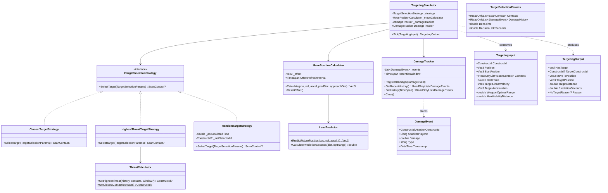

# NpcTargetingLib

A standalone C# class library for NPC target selection and threat assessment in a Dual Universe PvE mod. Pure data-in / data-out design with zero game-server dependencies -- feed it radar contacts and damage history, get back a selected target and a move-to position.

## Features

- **Pure simulation** -- no DI containers, no database, no NQ SDK types. Depends only on `NpcCommonLib` for `Vec3`, `ConstructId`, and `ScanContact`.
- **Pluggable target selection strategies** -- Closest, HighestThreat (default), and Random, all behind a single `ITargetSelectionStrategy` interface.
- **Threat assessment** -- `DamageTracker` maintains a thread-safe rolling damage history; `ThreatCalculator` ranks attackers by total recent damage with closest-contact fallback.
- **Lead prediction** -- range-tiered prediction seconds (10 / 30 / 60s) with kinematic future-position calculation (`p + v*t + 0.5*a*t^2`).
- **Move position calculation** -- combines predicted target position with a periodic random offset to prevent straight-line approaches.
- **Decision hold** -- `RandomTargetStrategy` holds its selection for a configurable duration before re-rolling, avoiding erratic target switching.

## Getting Started

### Add the project

```xml
<ProjectReference Include="..\NpcTargetingLib\NpcTargetingLib.csproj" />
```

The library targets `net8.0` and depends only on `NpcCommonLib`.

### Basic usage

```csharp
using NpcTargetingLib;
using NpcTargetingLib.Data;
using NpcCommonLib.Data;
using NpcCommonLib.Math;

// Create the simulator (defaults to HighestThreatTargetStrategy)
var simulator = new TargetingSimulator();

// Register damage events as they arrive from the game server
simulator.DamageTracker.RegisterDamage(new DamageEvent
{
    AttackerConstructId = new ConstructId(2001),
    AttackerPlayerId    = 42,
    Damage              = 5000,
    Type                = "kinetic",
    Timestamp           = DateTime.UtcNow,
});

// Build input for one tick
var input = new TargetingInput
{
    ConstructId   = new ConstructId(1001),
    Position      = new Vec3(1000, 2000, 3000),
    StartPosition = new Vec3(0, 0, 0),
    Contacts      = radarContacts,   // IReadOnlyList<ScanContact>
    DeltaTime     = 0.05,

    TargetLinearVelocity = new Vec3(50, 0, 0),
    TargetAcceleration   = Vec3.Zero,
    WeaponOptimalRange   = 50000,    // 50 km
};

// Tick
TargetingOutput result = simulator.Tick(input);

if (result.HasTarget)
{
    // result.TargetConstructId  -- who to shoot at
    // result.MoveToPosition     -- where to fly (includes prediction offset)
    // result.TargetDistance      -- raw distance to target
    // result.PredictionSeconds  -- 10, 30, or 60
}
else
{
    // result.Reason -- NoContacts or AllOutOfRange
}
```

To use a different strategy:

```csharp
var simulator = new TargetingSimulator(new ClosestTargetStrategy());
var simulator = new TargetingSimulator(new RandomTargetStrategy());
```

## Component Design

The following diagram shows how data flows through a single `Tick` call.

```mermaid
flowchart TD
    TI[TargetingInput] --> TS[TargetingSimulator.Tick]

    TS --> G1{Has contacts?}
    G1 -- no --> NT1[NoTarget: NoContacts]
    G1 -- yes --> SEL[ITargetSelectionStrategy.SelectTarget]

    SEL --> G2{Target found?}
    G2 -- no --> NT2[NoTarget: NoContacts]
    G2 -- yes --> VIS{Distance ≤<br/>MaxVisibilityDistance?}

    VIS -- no --> NT3[NoTarget: AllOutOfRange]
    VIS -- yes --> LP[LeadPredictor.CalculatePredictionSeconds<br/>10s / 30s / 60s by range tier]

    LP --> MPC[MovePositionCalculator.Calculate<br/>target + prediction + random offset]
    MPC --> TO[TargetingOutput]

    DT[DamageTracker] -.-> SEL
    TC[ThreatCalculator] -.-> SEL

    style TI fill:#2d333b,stroke:#539bf5
    style TO fill:#2d333b,stroke:#57ab5a
    style DT fill:#2d333b,stroke:#cba6f7,stroke-dasharray: 5 5
    style TC fill:#2d333b,stroke:#cba6f7,stroke-dasharray: 5 5
```



`DamageTracker` and `ThreatCalculator` are used internally by `HighestThreatTargetStrategy` -- they are not required if you use `ClosestTargetStrategy` or `RandomTargetStrategy`.

## Architecture



## Target Selection Strategies

All strategies implement `ITargetSelectionStrategy.SelectTarget(TargetSelectionParams) -> ScanContact?` and return the chosen contact or null.

### Closest (stateless)

Picks the contact with the smallest `Distance`. Simplest strategy -- good for patrol NPCs that engage whatever is nearest.

### HighestThreat (default, stateless)

Delegates to `ThreatCalculator.GetHighestThreat()`, which ranks attackers by total damage within a 1-minute window. Falls back to closest contact if no damage has been received recently. This is the default strategy, matching the original game behavior.

### Random (stateful)

Picks a random contact and holds that selection for `DecisionHoldSeconds` (default 30s) before re-rolling. If the held target disappears from radar, it re-rolls immediately. Good for creating unpredictable NPC behavior in multi-target engagements.

## Threat Assessment

### DamageTracker

Thread-safe rolling log of `DamageEvent` records. Automatically prunes events older than `RetentionWindow` (default 10 minutes) on each `RegisterDamage()` call. Your integration layer registers damage events as they arrive from the game server; `TargetingSimulator` exposes the tracker via `DamageTracker` for this purpose.

### ThreatCalculator

Pure static functions. `GetHighestThreat()` groups damage events by attacker within a 1-minute threat window, sums damage per attacker, and returns the highest. Falls back to `GetClosestContact()` if no recent damage exists. Returns null only when both damage history and contacts are empty.

## Lead Prediction

### LeadPredictor

Two static methods:

- **`CalculatePredictionSeconds(distance, optimalRange)`** -- returns 10s when beyond 2x optimal range, 30s between 1x-2x, 60s inside optimal range. Shorter prediction at long range avoids overshooting when the NPC is still closing distance.
- **`PredictFuturePosition(pos, vel, accel, t)`** -- standard kinematic equation `p + v*t + 0.5*a*t^2`.

### MovePositionCalculator

Combines the predicted position with a random directional offset (magnitude = half the approach distance). The offset is regenerated every 30 seconds (`OffsetRefreshInterval`) so the NPC weaves rather than flying a straight line. Lead prediction is opt-in via the `usePrediction` parameter (default off, matching current backend).

## Integration

Wire the three simulators together in your tick loop:

```csharp
// 1. Target selection
TargetingOutput targeting = targetingSimulator.Tick(targetingInput);

if (targeting.HasTarget)
{
    // 2. Movement -- fly toward the computed move position
    movementInput.TargetMovePosition = targeting.MoveToPosition;
    MovementOutput movement = movementSimulator.Tick(movementInput);

    // 3. Firing -- shoot at the selected target
    firingInput.TargetConstructId = targeting.TargetConstructId;
    firingInput.TargetPosition    = targeting.TargetPosition;
    FiringOutput firing = firingSimulator.Tick(firingInput);

    // 4. Push updates to game server
    await constructUpdateService.SendConstructUpdate(
        npcId, movement.Position, movement.Rotation, movement.Velocity);

    if (firing.ShouldFire)
        await shotDispatchService.DispatchShotAsync(firing.Shot);

    // 5. Feed back for next tick
    movementInput.Position = movement.Position;
    movementInput.Velocity = movement.Velocity;
    movementInput.Rotation = movement.Rotation;
}
```

Each simulator is independent and stateless (except for accumulators). They share only `NpcCommonLib` types (`Vec3`, `ConstructId`, `ScanContact`) and can be tested in isolation.
