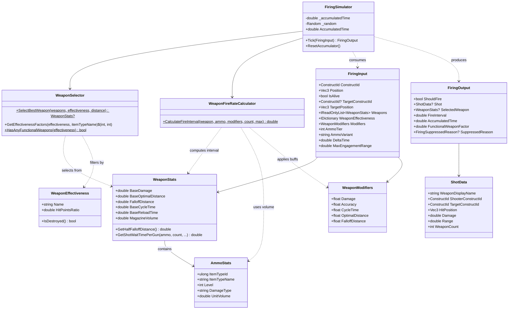

# NpcWeaponLib

A standalone C# class library for simulating NPC weapon firing in a Dual Universe PvE mod. Pure data-in / data-out design with accumulator-based timing -- feed it weapon stats, target info, and delta time, get back whether to fire and complete shot data.

## Features

- **Pure simulation** -- no DI containers, no Orleans grains, no NQ SDK types. Depends only on `NpcMovementLib` for `Vec3` and `ConstructId`.
- **Accumulator-based fire timing** -- tracks elapsed time across ticks and fires when the computed interval is reached, preventing timing drift.
- **Weapon selection by range** -- `WeaponSelector` picks the best functional weapon using half-falloff distance matching against target distance.
- **Ammo filtering** -- filters compatible ammo by tier level and damage variant (kinetic, thermic, etc.) with random selection among matches.
- **Weapon effectiveness tracking** -- factors in per-weapon hitpoint ratios so destroyed weapons are excluded and fire rate scales with functional count.
- **Fire rate pipeline** -- six-step calculation chain from magazine capacity through sustained ROF to per-gun wait time, with configurable buff factors.
- **Modifier system** -- per-NPC `WeaponModifiers` multiply base weapon stats (damage, accuracy, cycle time, range, tracking, aiming cone) for variant NPCs.
- **Integration interfaces** -- `IHitPositionService`, `ISafeZoneService`, `IShotDispatchService`, and `IWeaponHealthService` define the contract your game-server adapter must implement.

## Getting Started

### Add the project

```xml
<ProjectReference Include="..\NpcWeaponLib\NpcWeaponLib.csproj" />
```

The library targets `net8.0` and depends only on `NpcMovementLib` (for `Vec3`, `ConstructId`).

### Basic usage

```csharp
using NpcWeaponLib;
using NpcWeaponLib.Data;
using NpcMovementLib.Math;
using NpcMovementLib.Data;

var simulator = new FiringSimulator();

var input = new FiringInput
{
    ConstructId   = new ConstructId(1001),
    Position      = new Vec3(1000, 2000, 3000),
    ConstructSize = 128,
    IsAlive       = true,

    TargetConstructId = new ConstructId(2001),
    TargetPosition    = new Vec3(50000, 60000, 70000),

    Weapons              = weapons,        // IReadOnlyList<WeaponStats>
    WeaponEffectiveness  = effectiveness,  // IDictionary<string, IList<WeaponEffectiveness>>
    Modifiers            = new WeaponModifiers { Damage = 2.0f, CycleTime = 0.75f },

    AmmoTier    = 3,
    AmmoVariant = "Kinetic",
    DeltaTime   = 0.05,
    MaxWeaponCount = 4,
};

FiringOutput result = simulator.Tick(input);

if (result.ShouldFire)
{
    // result.Shot contains complete ShotData ready for dispatch
    await shotDispatchService.DispatchShotAsync(result.Shot);
}
else
{
    // result.SuppressedReason tells you why (cooldown, out of range, etc.)
}
```

## Component Design

The following diagram shows how data flows through a single `Tick` call.

```mermaid
flowchart TD
    FI[FiringInput] --> FS[FiringSimulator.Tick]

    FS --> G1{IsAlive?}
    G1 -- no --> SUP1[Suppressed: NotAlive]
    G1 -- yes --> G2{Has target?}
    G2 -- no --> SUP2[Suppressed: NoTarget]
    G2 -- yes --> G3{Has weapons?}
    G3 -- no --> SUP3[Suppressed: NoWeapons]
    G3 -- yes --> G4{Any functional?}
    G4 -- no --> SUP4[Suppressed: AllWeaponsDestroyed]
    G4 -- yes --> G5{In range?}
    G5 -- no --> SUP5[Suppressed: OutOfRange]

    G5 -- yes --> WS[WeaponSelector.SelectBestWeapon<br/>half-falloff distance matching]
    WS --> AF[Filter ammo by tier & variant]
    AF -- no ammo --> SUP6[Suppressed: NoCompatibleAmmo]
    AF -- has ammo --> FRC[WeaponFireRateCalculator<br/>compute fire interval]
    FRC --> ACC{Accumulated time<br/>≥ fire interval?}
    ACC -- no --> SUP7[Suppressed: CooldownNotReached]
    ACC -- yes --> FIRE[Produce ShotData]

    HPS[IHitPositionService] -.-> FIRE
    SZS[ISafeZoneService] -.-> FI
    SDS[IShotDispatchService] -.-> FIRE

    style FI fill:#2d333b,stroke:#539bf5
    style FIRE fill:#2d333b,stroke:#57ab5a
    style HPS fill:#2d333b,stroke:#cba6f7,stroke-dasharray: 5 5
    style SZS fill:#2d333b,stroke:#cba6f7,stroke-dasharray: 5 5
    style SDS fill:#2d333b,stroke:#cba6f7,stroke-dasharray: 5 5
```



`IHitPositionService`, `ISafeZoneService`, and `IShotDispatchService` are optional consumer-side services -- they are not called by `FiringSimulator` itself but are used by your integration layer before/after `Tick`.

## Architecture



## Fire Rate Pipeline

`WeaponStats` computes the effective fire interval through a six-step formula chain. Each step feeds into the next:

| Step | Method | Formula |
|---|---|---|
| 1 | `GetNumberOfShotsInMagazine` | `Floor(MagazineVolume * magBuff / ammo.UnitVolume)` |
| 2 | `GetTimeToEmpty` | `shots * (BaseCycleTime * cycleBuff)` |
| 3 | `GetReloadTime` | `BaseReloadTime * reloadBuff` |
| 4 | `GetTotalCycleTime` | `timeToEmpty + reloadTime` |
| 5 | `GetSustainedRateOfFire` | `shots / totalCycleTime` |
| 6 | `GetShotWaitTime` | `1 / sustainedROF` (clamped -- see below) |

**Per-gun scaling:** `GetShotWaitTimePerGun` divides the wait time by `Clamp(weaponCount, 1, 10)`, so multiple functional weapons of the same type fire faster.

**Buff defaults:** `magBuff` defaults to 1.5, `cycleBuff` and `reloadBuff` default to 0.5625. The `CycleTime` modifier from `WeaponModifiers` is passed as `cycleBuff`.

**Clamping:** All buff factors are clamped to `[0.1, 5.0]` before calculation. If the resulting wait time drops to 0.5s or below, it floors to `Clamp(BaseCycleTime, 0.5, 60)` to prevent unrealistically fast fire rates.

## Integration Interfaces

These interfaces define the boundary between `NpcWeaponLib` and your game server. You implement them; the library's consumer layer uses them alongside `FiringSimulator`.

### IHitPositionService

Determines where on a target construct a shot will impact. In the game backend this queries the voxel service for a random surface point.

```csharp
public interface IHitPositionService
{
    Task<Vec3> GetHitPositionAsync(ConstructId targetConstructId, Vec3 shooterPosition);
}
```

### ISafeZoneService

Checks whether a construct is inside a PvP-free safe zone. Firing should be suppressed when either shooter or target is in a safe zone.

```csharp
public interface ISafeZoneService
{
    Task<bool> IsInSafeZoneAsync(ConstructId constructId);
}
```

### IShotDispatchService

Dispatches a computed `ShotData` to the game server for impact processing. Maps to either the mod action system or the legacy `INpcShotGrain.Fire()` path.

```csharp
public interface IShotDispatchService
{
    Task DispatchShotAsync(ShotData shot);
}
```

### IWeaponHealthService

Reads per-weapon hitpoint ratios from the game server's construct element system.

```csharp
public interface IWeaponHealthService
{
    Task<IDictionary<string, IList<WeaponEffectiveness>>> GetWeaponEffectiveness(ConstructId constructId);
}
```

## FiringSuppressedReason

When `FiringOutput.ShouldFire` is `false`, the `SuppressedReason` enum tells you why:

| Value | Meaning |
|---|---|
| `NotAlive` | NPC is dead -- `FiringInput.IsAlive` is false |
| `NoTarget` | No target assigned -- `TargetConstructId` is null or zero |
| `NoWeapons` | Construct has no weapons in its `Weapons` list |
| `AllWeaponsDestroyed` | All weapon elements have hitpoints at or below 1% |
| `NoCompatibleAmmo` | No ammo matched the configured `AmmoTier` and `AmmoVariant` on the selected weapon |
| `OutOfRange` | Target distance exceeds `MaxEngagementRange` (default 400 km / 2 SU) |
| `CooldownNotReached` | Accumulator has not yet reached the fire interval -- weapon is between shots |
